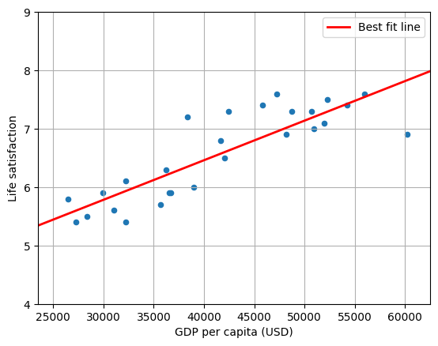

# Predicting Life Satisfaction with Linear Regression
### Overview: </br>
A linear regression model was used to predict the life satisfaction score of different countries based on their GDP. For a given GDP, life satisfaction can then be predicted. The training and running of the linear model was applied using Scikit-Learn.   

### Example Prediction: </br> 
Make a prediction for Cyprus:

```python
x_new = [[37_655.2]]  # Cyprus' GDP per capita in 2020
print(model.predict(x_new))
```
Cyprus' predicted life satisfaction score is 6.3.</br>

### Applications: </br>
Linear regression is a simple model that can be used to interpolate data points which have not been provided by the data set. Therefore, it is a good general assumption for making predictions. </br>
### Future work: </br>
Linear regression offers a limited snapshot to life satisfaction, using more data points will skew this data, a polynomial model may perform better.

 </br>
Fig.1 Linear Regression Model Applied to the data 
